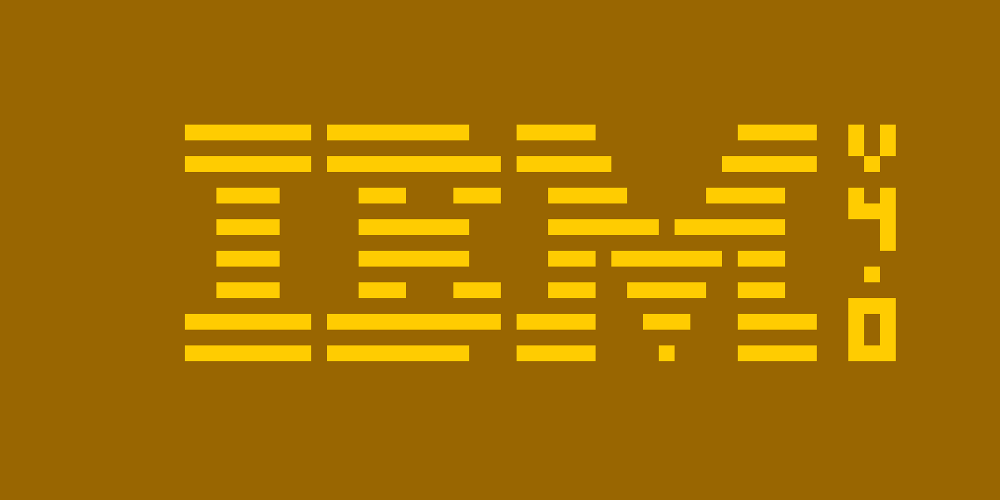

# Emulation of CHIP-8 CPU

This is a personal project wherin the CHIP-8 CPU is emulated using SDL2 and Rust.

# Requirements

[SDL2](https://wiki.libsdl.org/SDL2/Installation) must be installed on the system.